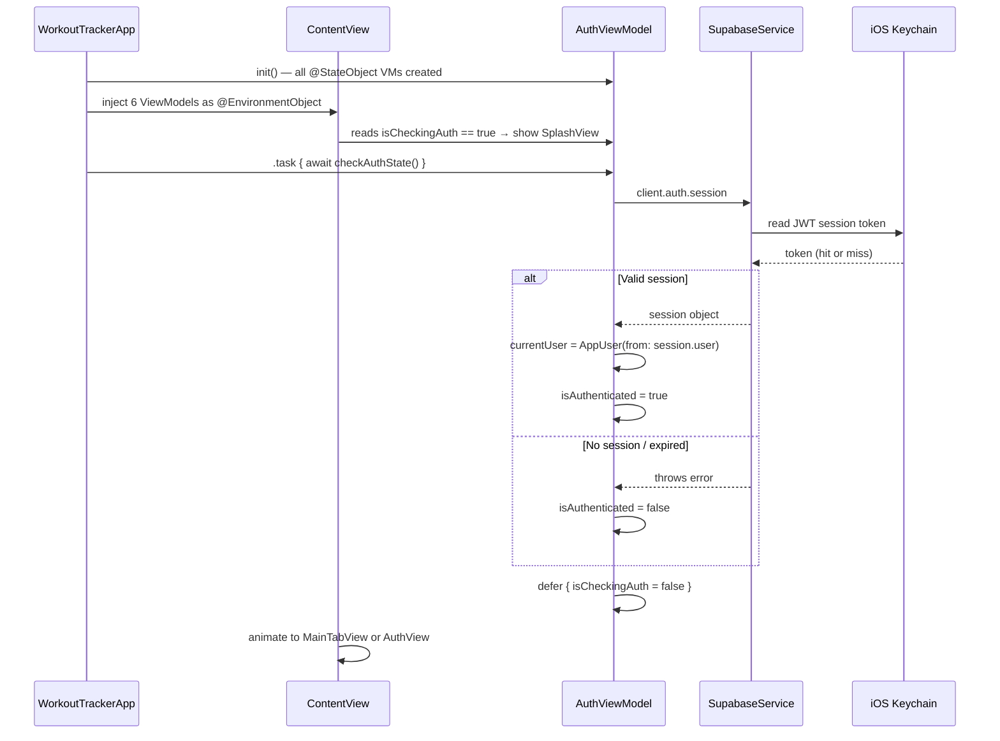
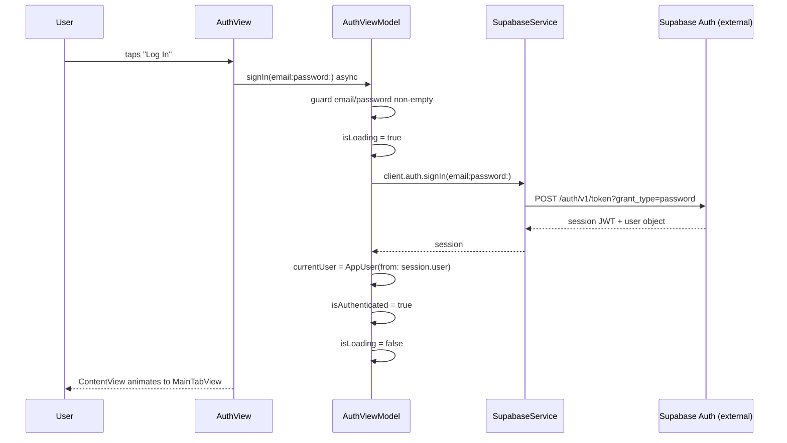
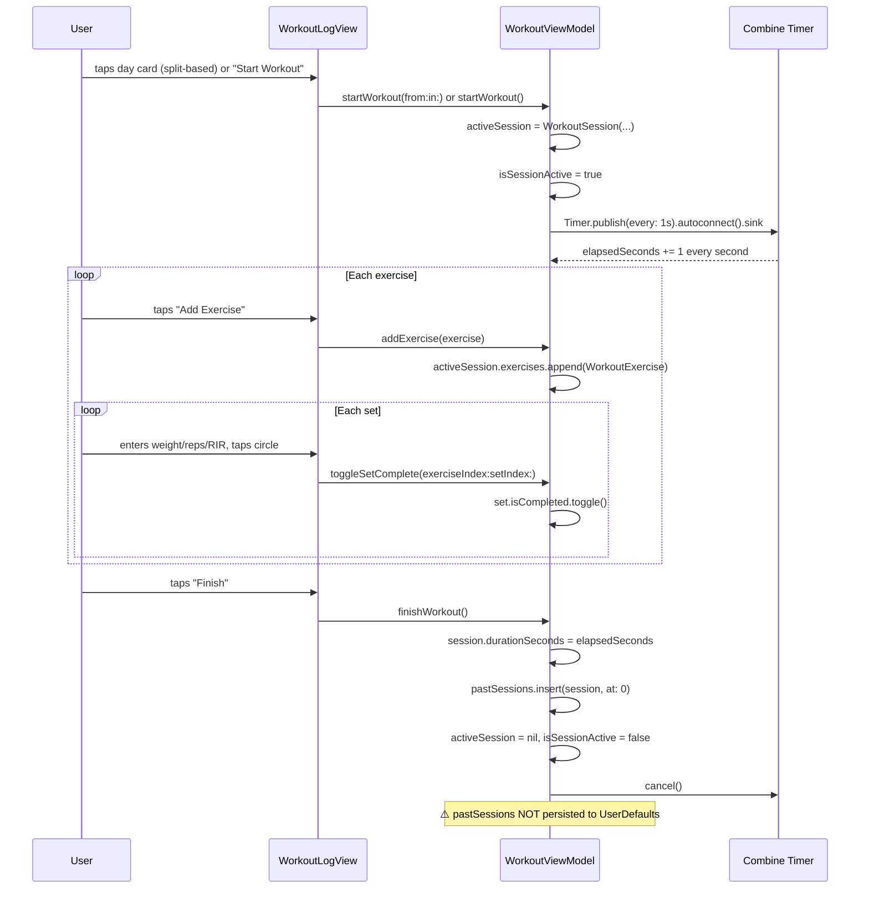
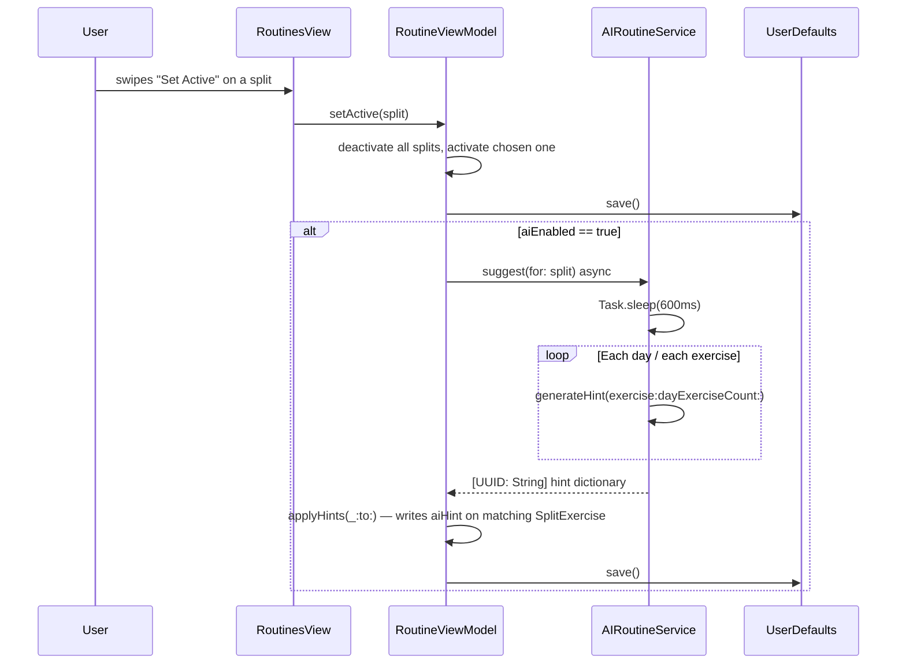
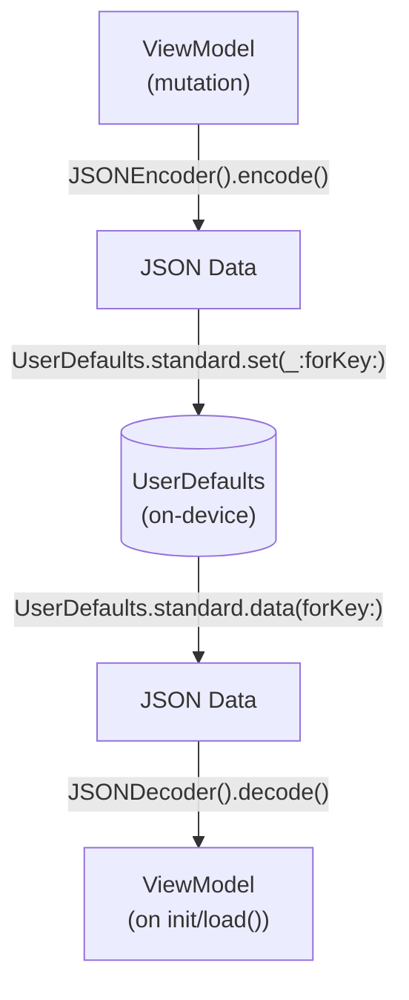
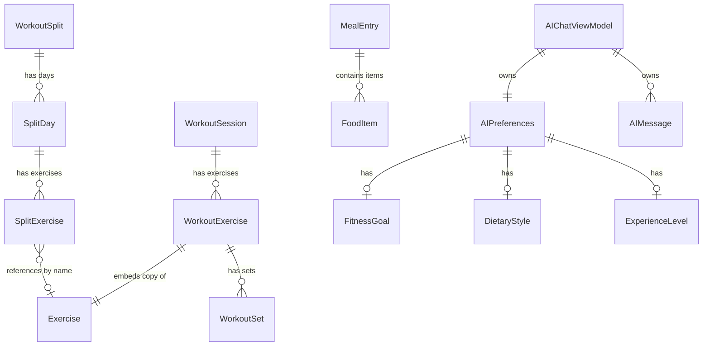

# WorkoutTracker — Comprehensive Project Documentation

> Generated: 2026-05-20 | Source: Full codebase analysis

---

## Table of Contents

1. [Project Overview](#1-project-overview)
2. [Tech Stack](#2-tech-stack)
3. [Project Structure](#3-project-structure)
4. [Data Flow Diagrams](#4-data-flow-diagrams)
5. [Database & Data Models](#5-database--data-models)
6. [API Reference](#6-api-reference)
7. [State Management](#7-state-management)
8. [Configuration & Environment](#8-configuration--environment)
9. [Infrastructure & Deployment](#9-infrastructure--deployment)
10. [Authentication & Security](#10-authentication--security)
11. [Testing Strategy](#11-testing-strategy)
12. [Key Algorithms & Business Logic](#12-key-algorithms--business-logic)
13. [External Integrations](#13-external-integrations)
14. [Error Handling Strategy](#14-error-handling-strategy)
15. [Local Development Setup](#15-local-development-setup)
16. [Gap Report](#16-gap-report)

---

## 1. Project Overview

### Purpose and Problem Solved

WorkoutTracker is a native iOS fitness companion app built in SwiftUI. It targets intermediate-to-advanced gym athletes who want structured, data-driven training without paying for a subscription-locked commercial app.

The app solves four core problems in a single dark-themed interface:

1. **Workout logging** — Set-by-set logging with weight, reps, and RIR (Reps In Reserve) tracking
2. **Routine planning** — Create and manage named training splits (e.g., Push/Pull/Legs) with prescribed sets/reps/RIR per exercise
3. **Nutrition tracking** — Log meals by type, select foods from a built-in library or scan product barcodes (Open Food Facts), track daily macros against configurable targets
4. **Progress analysis** — Swift Charts visualizations for weight trends and nutrition, personal records display, and a conversational AI coach interface

### High-Level Architecture Summary

The app follows a strict **MVVM (Model-View-ViewModel)** layered architecture:

```
┌─────────────────────────────────────────────────────┐
│  Presentation Layer (Views)                         │
│  SwiftUI views, sub-components, sheets, overlays    │
├─────────────────────────────────────────────────────┤
│  ViewModel Layer                                    │
│  @MainActor ObservableObjects, business logic,      │
│  persistence coordination                           │
├─────────────────────────────────────────────────────┤
│  Service Layer                                      │
│  SupabaseService, FoodLookupService,                │
│  AIRoutineService (all singletons)                  │
├─────────────────────────────────────────────────────┤
│  Model Layer                                        │
│  Codable value types (structs + enums)              │
├─────────────────────────────────────────────────────┤
│  Persistence                          │  External   │
│  UserDefaults (JSON)                  │  Supabase   │
│  iOS Keychain (via Supabase SDK)      │  Open Food  │
│  UserDefaults (profile photo Data)    │  Facts API  │
└───────────────────────────────────────┴─────────────┘
```

All six ViewModels are created at app launch as `@StateObject` instances and injected into the SwiftUI environment via `@EnvironmentObject`. This means every view in the hierarchy can access any ViewModel without prop-drilling.

### Key Design Decisions and Tradeoffs

| Decision | Rationale | Tradeoff |
|---|---|---|
| All persistence via UserDefaults (not CoreData/SwiftData) | Fast to implement, no schema migrations needed, works fully offline | No querying, no relations, degrades at large data volumes |
| `@MainActor` on every ViewModel | Guarantees all `@Published` mutations happen on the main thread — no `DispatchQueue.main.async` noise | Slightly reduces parallelism for CPU work (acceptable here) |
| Singleton services with no state | Safe to call from any actor; easy to test by replacement | Not dependency-injectable by default |
| Rule-based AI (no LLM call) | App works offline with zero AI cost today; scaffolding for real LLM is in place | AI responses are rigid keyword matching, not conversational |
| Exercise library hardcoded in-memory | No server round-trip for list browsing; works offline | Cannot be updated without a new app release |
| Feature flags via `@AppStorage` | Nutrition and body weight tracking are off by default to reduce new-user overwhelm | Flag state is per-device; no server-driven rollout |

### Monorepo vs. Single Repo

Single Xcode project (`WorkoutTracker.xcodeproj`). One target, one scheme. No workspace-level multi-target setup. All Swift Package Manager dependencies declared inside the `.xcodeproj`.

---

## 2. Tech Stack

### Core Language & Platform

| Name | Version | Role | Part of System |
|---|---|---|---|
| Swift | 5.9+ (inferred from `#Preview` macro and `if case let` syntax) | Primary language | All |
| SwiftUI | iOS 17+ (inferred from `@Observable`-free but `.onChange(of:)` two-param used) | UI framework | Frontend |
| Combine | Bundled with iOS | Workout session timer via `Timer.publish` | Frontend |
| AVFoundation | Bundled with iOS | Camera access and barcode decoding | Frontend |
| Swift Charts | iOS 16+ (bundled) | Body weight and nutrition trend charts | Frontend |
| PhotosUI | Bundled with iOS | Profile photo picker | Frontend |
| UserNotifications | Bundled with iOS | Push notification permission request | Frontend |

### Third-Party Dependencies (from `Package.resolved`)

| Package | Version | Why Used | Files |
|---|---|---|---|
| `supabase-swift` | `2.46.0` | Auth SDK — sign-in, sign-up, session restore/refresh via iOS Keychain, sign-out | `SupabaseService.swift`, `AuthViewModel.swift` |
| `swift-crypto` | `4.5.0` | Transitive dep of supabase-swift — JWT cryptographic operations | Indirect |
| `swift-asn1` | `1.7.0` | Transitive dep of supabase-swift — ASN.1 parsing for crypto | Indirect |
| `swift-http-types` | `1.5.1` | Transitive dep of supabase-swift — typed HTTP request/response | Indirect |
| `swift-clocks` | `1.0.6` | Transitive dep of supabase-swift / pointfreeco | Indirect |
| `swift-concurrency-extras` | `1.3.2` | Transitive dep of supabase-swift / pointfreeco | Indirect |
| `xctest-dynamic-overlay` | `1.9.0` | Transitive dep of supabase-swift / pointfreeco — unimplemented stubs in tests | Indirect |

### External APIs

| Service | Protocol | Purpose |
|---|---|---|
| Supabase Auth | HTTPS REST + JWT | User authentication, session management |
| Open Food Facts | HTTPS REST (GET) | Barcode → product nutrition lookup |

### Build & Tooling

| Tool | Version / Notes | Purpose |
|---|---|---|
| Xcode | 15+ (`.xcodeproj` `objectVersion = 56`) | IDE and build system |
| Swift Package Manager | Bundled with Xcode | Dependency management (via `.xcworkspace/xcshareddata/swiftpm/`) |
| Git | Any | Version control |
| GitHub | `github.com/hudaifa-9805/WorkoutTracker` | Remote repository |

---

## 3. Project Structure

```
WorkoutTracker/                        ← Git root
├── .gitignore                         ← Standard Xcode gitignore + Secrets.swift exclusion
├── DOCUMENTATION.md                   ← This file
├── docs/
│   ├── PRD.md                         ← Product Requirements Document
│   ├── ARCHITECTURE.md                ← Architecture overview with Mermaid diagrams
│   └── ERD.md                         ← Entity relationship diagram (Mermaid)
│
├── WorkoutTracker.xcodeproj/
│   ├── project.pbxproj                ← Xcode project manifest (source of truth for build targets)
│   └── project.xcworkspace/
│       └── xcshareddata/swiftpm/
│           └── Package.resolved       ← Locked dependency versions (commit this)
│
└── WorkoutTracker/                    ← App source root
    ├── WorkoutTrackerApp.swift        ← @main entry point; creates all 6 ViewModels as @StateObject;
    │                                  ← injects via .environmentObject; Color constants (appBackground,
    │                                  ← orangeGradientEnd); maps @AppStorage "appearanceMode" → ColorScheme
    ├── ContentView.swift              ← Auth gate; three states: SplashView | AuthView | MainTabView;
    │                                  ← MainTabView hosts 4 tabs + FloatingAIButton
    │
    ├── Models/                        ← Pure Codable value types; no business logic; no imports except Foundation
    │   ├── Exercise.swift             ← Exercise struct + ExerciseCategory/MuscleGroup/Equipment enums;
    │   │                              ← 10-item Exercise.sampleData used as the in-memory exercise library
    │   ├── WorkoutSet.swift           ← One set: weight, reps, RIR, isCompleted, SetType (W/S/D);
    │   │                              ← computed volume = weight × reps
    │   ├── Workout.swift              ← WorkoutSession (top-level container) + WorkoutExercise;
    │   │                              ← computed totalSets, totalVolume, formattedDuration
    │   ├── WorkoutSplit.swift         ← Training plan hierarchy: WorkoutSplit → SplitDay → SplitExercise;
    │   │                              ← SplitExercise carries optional aiHint: String?;
    │   │                              ← WorkoutSplit.sampleSplits seeds first-launch UserDefaults
    │   ├── NutritionModels.swift      ← FoodItem (per-100g macros + serving scaling), MealType,
    │   │                              ← MealEntry, MacroTarget; FoodItem.sampleFoods (15 items)
    │   ├── BodyWeightEntry.swift      ← Single weight measurement; stores kg canonically; computed lbs;
    │   │                              ← displayWeight(unit:) helper
    │   └── AIModels.swift             ← AIMessage (role: user/assistant), ChatContext (stat snapshot),
    │                                  ← AIPreferences (goal/level/diet/targets) with nested enums
    │
    ├── Services/                      ← Singleton service objects; no mutable state; safe from any actor
    │   ├── SupabaseService.swift      ← Wraps SupabaseClient; exposes .client for auth calls;
    │   │                              ← credentials read from Secrets.swift (gitignored)
    │   ├── FoodLookupService.swift    ← Open Food Facts REST lookup; private DTO types (OFFResponse etc.);
    │   │                              ← returns FoodLookupResult enum (.found/.notFound/.networkError)
    │   ├── AIRoutineService.swift     ← Rule-based coaching hint generator (5 heuristics);
    │   │                              ← simulates 600ms latency; marked for LLM swap-in
    │   ├── Secrets.swift              ← ⚠️ GITIGNORED — Supabase URL + anon key constants;
    │   │                              ← copy Secrets.swift.template to create
    │   └── Secrets.swift.template    ← Committed template showing required constants
    │
    ├── ViewModels/                    ← All @MainActor final class ObservableObject
    │   ├── AuthViewModel.swift        ← isAuthenticated, isCheckingAuth, currentUser: AppUser;
    │   │                              ← signIn/signUp/signOut/checkAuthState; AppUser value type here
    │   ├── WorkoutViewModel.swift     ← activeSession, pastSessions (IN-MEMORY ONLY — not persisted!);
    │   │                              ← Combine timer; startWorkout/addExercise/finishWorkout/etc.
    │   ├── RoutineViewModel.swift     ← splits: [WorkoutSplit] persisted to UserDefaults;
    │   │                              ← activeSplit; aiEnabled toggle; AI hint coordination
    │   ├── NutritionViewModel.swift   ← entries: [MealEntry] + macroTarget persisted separately;
    │   │                              ← todayEntries/totals; caloriesPerDay(days:) analytics
    │   ├── BodyWeightViewModel.swift  ← entries: [BodyWeightEntry] persisted; 7d/30d windows;
    │   │                              ← weeklyAverage, monthlyChange computed stats
    │   ├── AIChatViewModel.swift      ← messages: [AIMessage] (session-only, not persisted);
    │   │                              ← preferences: AIPreferences persisted; buildContext()
    │   └── ExerciseLibraryViewModel.swift ← Filter state only; filteredExercises, groupedExercises
    │                                      ← backed by Exercise.sampleData
    │
    ├── Views/
    │   ├── Auth/
    │   │   └── AuthView.swift         ← Email/password login+signup form; animated mode toggle;
    │   │                              ← AuthTextField, AuthPasswordField components
    │   ├── Home/
    │   │   └── HomeView.swift         ← Today dashboard: greeting, 3-stat cards, active workout banner,
    │   │                              ← last 3 sessions; StatCard, SectionHeader, etc. components
    │   ├── Log/
    │   │   ├── LogDashboardView.swift ← Log tab host; segmented picker (Workout/Nutrition/Body);
    │   │   │                          ← nutrition and body segments are feature-flagged
    │   │   ├── NutritionLogView.swift ← Calorie ring, macro bars, meal list; AddMealSheet (barcode + library);
    │   │   │                          ← EditMealSheet; ServingStepper; MacroBar component
    │   │   ├── BodyWeightLogView.swift← Stat cards, Swift Charts trend line, history list; LogWeightSheet
    │   │   └── BarcodeScannerView.swift ← Full-screen camera scanner; 6-state FSM; AVFoundation UIKit bridge;
    │   │                                ← ScannerVC manages AVCaptureSession on dedicated sessionQueue
    │   ├── WorkoutLog/
    │   │   └── WorkoutLogView.swift   ← Modal workout session view + ALL shared workout UI components:
    │   │                              ← WorkoutTimerBanner, EmptyWorkoutStartView, SplitDayPickerView,
    │   │                              ← ActiveWorkoutScrollContent, ExerciseLogCard, SetColumnHeader,
    │   │                              ← SetRow, LogTextField, RIRStepper, ExercisePickerSheet
    │   ├── Progress/
    │   │   └── ProgressView.swift     ← Swift Charts for weight+calories; metric/range pickers;
    │   │                              ← placeholder PR cards (mockPRs); stub all-time stats
    │   ├── Routines/
    │   │   ├── RoutinesView.swift     ← Split list with AI toggle; ActiveSplitCard; SplitRow;
    │   │   │                          ← SplitDetailView with AIHintBanner
    │   │   └── SplitEditorView.swift  ← Create/edit split; day reorder/delete; DayExerciseEditorView;
    │   │                              ← SplitExerciseEditorSheet; TargetStepper
    │   ├── Account/
    │   │   ├── AccountView.swift      ← Profile header (photo picker), training/features/preferences/data/
    │   │   │                          ← support/sign-out sections; all settings sheets inline
    │   │   └── AIPreferencesView.swift← Goal/level/diet picker + numeric nutrition/weight targets
    │   ├── ExerciseLibrary/
    │   │   └── ExerciseLibraryView.swift ← Searchable+filterable exercise browse; ExerciseDetailView;
    │   │                                 ← FlowLayout custom Layout; ⚠️ NOT WIRED TO NAVIGATION
    │   └── AI/
    │       └── AIChatView.swift       ← Chat bubble list, TypingIndicator, input bar;
    │                                  ← FloatingAIButton (used in MainTabView) defined here
    │
    ├── Assets.xcassets/               ← App icon, accent color
    └── Preview Content/               ← SwiftUI preview assets
```

---

## 4. Data Flow Diagrams

### 4.1 App Launch & Auth Gate



### 4.2 Sign-In Flow



### 4.3 Workout Session Lifecycle



### 4.4 Barcode Scan → Meal Log

```mermaid
sequenceDiagram
    participant User
    participant AMS as AddMealSheet
    participant BSV as BarcodeScannerView
    participant SVC as ScannerVC (UIKit)
    participant AV as AVFoundation
    participant FLS as FoodLookupService
    participant OFF as Open Food Facts API
    participant NVM as NutritionViewModel
    participant UD as UserDefaults

    User->>AMS: taps "Scan Barcode"
    AMS->>BSV: fullScreenCover
    BSV->>SVC: viewDidLoad → checkPermission()
    SVC->>AV: AVCaptureDevice.requestAccess(for: .video)
    AV-->>SVC: granted
    SVC->>SVC: setupSession() on sessionQueue
    SVC->>SVC: addOverlay() on main thread
    SVC->>AV: session.startRunning() on sessionQueue
    SVC-->>BSV: onStateChange(.scanning)
    User->>AV: points camera at barcode
    AV->>SVC: metadataOutput delegate fires (on main)
    SVC->>SVC: hasFired = true
    SVC->>AV: session.stopRunning() on sessionQueue
    SVC-->>BSV: onStateChange(.success(barcodeString))
    BSV->>BSV: delay 750ms then onScan(code)
    BSV->>AMS: onScan callback with barcode string
    AMS->>AMS: isLookingUp = true
    AMS->>FLS: lookup(barcode:) async
    FLS->>OFF: GET /api/v0/product/{barcode}.json (10s timeout)
    OFF-->>FLS: JSON response
    FLS->>FLS: decode OFFResponse → FoodItem
    FLS-->>AMS: .found(FoodItem)
    AMS->>AMS: selectedItems.append(item)
    AMS->>AMS: scanBanner = .success(name)
    User->>AMS: taps "Add"
    AMS->>NVM: addMeal(MealEntry)
    NVM->>UD: JSONEncoder().encode(entries) → nutrition_entries_v1
```

### 4.5 AI Coach Chat Flow

```mermaid
sequenceDiagram
    participant User
    participant AICV as AIChatView
    participant AIVM as AIChatViewModel
    participant NVM as NutritionViewModel
    participant BWM as BodyWeightViewModel

    User->>AICV: types message, taps send
    AICV->>AIVM: buildContext(nutritionVM:bodyWeightVM:recentWorkouts:0)
    AIVM->>NVM: reads todayCalories, macroTarget.calories/protein
    AIVM->>BWM: reads latest?.weightKg
    AIVM-->>AICV: ChatContext snapshot
    AICV->>AIVM: send(message:context:) async
    AIVM->>AIVM: messages.append(AIMessage(role:.user))
    AIVM->>AIVM: isLoading = true
    AIVM->>AIVM: generateReply(to:context:) — Task.sleep(900ms)
    AIVM->>AIVM: keyword match on message.lowercased()
    AIVM->>AIVM: messages.append(AIMessage(role:.assistant))
    AIVM->>AIVM: isLoading = false
    Note over AIVM: ⚠️ Rule-based stub; no real LLM call
```

### 4.6 AI Routine Hints Flow



### 4.7 UserDefaults Persistence Flow (Generic)



---

## 5. Database & Data Models

### Overview

The app uses **no relational database**. All app data is stored as JSON in UserDefaults. Supabase is used only for authentication (user accounts, sessions). There are no remote tables or server-side data beyond the auth schema managed by Supabase itself.

### In-Memory Models (Swift Structs)

All models conform to `Codable` for UserDefaults persistence and `Identifiable` for SwiftUI list rendering.

#### `Exercise`

| Field | Type | Constraints | Notes |
|---|---|---|---|
| `id` | `UUID` | stable, unique | Randomly generated at struct init |
| `name` | `String` | non-empty | Display name, used for name-based matching in `WorkoutViewModel` |
| `category` | `ExerciseCategory` | `.strength`, `.cardio`, `.flexibility` | |
| `primaryMuscles` | `[MuscleGroup]` | ≥ 1 | |
| `secondaryMuscles` | `[MuscleGroup]` | ≥ 0 | |
| `equipment` | `Equipment` | 7 cases | |
| `instructions` | `String` | | Coaching cue text |

**Sample data:** 10 hardcoded exercises (Bench Press, Squat, Deadlift, Pull-Up, Overhead Press, Romanian Deadlift, Incline Dumbbell Press, Cable Row, Lat Pulldown, Tricep Pushdown).

#### `WorkoutSet`

| Field | Type | Default | Notes |
|---|---|---|---|
| `id` | `UUID` | new UUID | |
| `setNumber` | `Int` | — | 1-based display index |
| `weight` | `Double` | `0` | Kilograms |
| `reps` | `Int` | `0` | |
| `rir` | `Int` | `2` | Reps In Reserve, 0–4 |
| `isCompleted` | `Bool` | `false` | |
| `setType` | `SetType` | `.working` | Warmup / Working / DropSet |
| `volume` *(computed)* | `Double` | — | `weight × reps` |

#### `WorkoutExercise`

| Field | Type | Notes |
|---|---|---|
| `id` | `UUID` | |
| `exercise` | `Exercise` | Embedded copy — denormalized for offline reliability |
| `sets` | `[WorkoutSet]` | |
| `notes` | `String` | |
| `totalVolume` *(computed)* | `Double` | Completed sets only |
| `bestSet` *(computed)* | `WorkoutSet?` | Heaviest completed set |

#### `WorkoutSession`

| Field | Type | Notes |
|---|---|---|
| `id` | `UUID` | |
| `name` | `String` | Auto-generated or from split |
| `date` | `Date` | Session start time |
| `exercises` | `[WorkoutExercise]` | |
| `notes` | `String` | |
| `durationSeconds` | `Int?` | Set on `finishWorkout()` |
| `totalSets` *(computed)* | `Int` | Completed sets only |
| `totalVolume` *(computed)* | `Double` | kg, completed only |
| `formattedDuration` *(computed)* | `String` | "1h 15m" / "45m" |

⚠️ **Critical gap:** `WorkoutSession` objects in `pastSessions` are **never persisted** — they are lost on app restart.

#### `WorkoutSplit`

| Field | Type | Notes |
|---|---|---|
| `id` | `UUID` | |
| `name` | `String` | |
| `description` | `String` | |
| `days` | `[SplitDay]` | Ordered by `day.order` |
| `createdAt` | `Date` | |
| `isActive` | `Bool` | At most one true at a time (enforced by `RoutineViewModel.setActive`) |
| `aiSuggestionsEnabled` | `Bool` | ⚠️ Unused — global `RoutineViewModel.aiEnabled` used instead |

#### `SplitDay`

| Field | Type | Notes |
|---|---|---|
| `id` | `UUID` | |
| `name` | `String` | e.g. "Push", "Upper A" |
| `order` | `Int` | 0-based, recomputed on drag-reorder |
| `exercises` | `[SplitExercise]` | |
| `muscleSummary` *(computed)* | `String` | "Chest · Triceps · Shoulders" (3 max) |

#### `SplitExercise`

| Field | Type | Constraints |
|---|---|---|
| `id` | `UUID` | |
| `exerciseName` | `String` | Name only — no FK to `Exercise.id` |
| `targetSets` | `Int` | 1–10 |
| `targetReps` | `Int` | 1–30 |
| `targetRIR` | `Int` | 0–4 |
| `order` | `Int` | 0-based |
| `targetMuscles` | `[String]` | Denormalized muscle names |
| `aiHint` | `String?` | Written by `AIRoutineService`, displayed in `AIHintBanner` |

#### `FoodItem`

| Field | Type | Notes |
|---|---|---|
| `id` | `UUID` | |
| `name` | `String` | |
| `caloriesPer100g` | `Double` | |
| `proteinPer100g` | `Double` | |
| `carbsPer100g` | `Double` | |
| `fatPer100g` | `Double` | |
| `servingGrams` | `Double` | Default 100 |
| `barcode` | `String?` | EAN/UPC if scanned |
| `calories/protein/carbs/fat` *(computed)* | `Double` | `per100g × servingGrams / 100` |

#### `MealEntry`

| Field | Type | Notes |
|---|---|---|
| `id` | `UUID` | |
| `date` | `Date` | |
| `type` | `MealType` | Breakfast / Lunch / Dinner / Snack |
| `items` | `[FoodItem]` | |
| `notes` | `String` | |
| `totalCalories/Protein/Carbs/Fat` *(computed)* | `Double` | Sums across items |

#### `MacroTarget`

| Field | Type | Default |
|---|---|---|
| `calories` | `Double` | 2000 kcal |
| `protein` | `Double` | 150g |
| `carbs` | `Double` | 220g |
| `fat` | `Double` | 65g |

#### `BodyWeightEntry`

| Field | Type | Notes |
|---|---|---|
| `id` | `UUID` | |
| `date` | `Date` | |
| `weightKg` | `Double` | Always stored in kg regardless of display unit |
| `notes` | `String` | |
| `weightLbs` *(computed)* | `Double` | `weightKg × 2.20462` |

#### `AIMessage`

| Field | Type | Notes |
|---|---|---|
| `id` | `UUID` | |
| `role` | `AIRole` | `.user` / `.assistant` |
| `content` | `String` | |
| `timestamp` | `Date` | |

Chat history is **not persisted** — messages are lost on app restart.

#### `AIPreferences`

| Field | Type | Default |
|---|---|---|
| `fitnessGoal` | `FitnessGoal` | `.buildMuscle` |
| `dietaryStyle` | `DietaryStyle` | `.standard` |
| `experienceLevel` | `ExperienceLevel` | `.intermediate` |
| `targetCalories` | `Double` | 2000 |
| `targetProteinG` | `Double` | 150 |
| `targetWeightKg` | `Double?` | `nil` |

### UserDefaults Storage Map

| Key | Owner ViewModel | Stored Type | Notes |
|---|---|---|---|
| `workout_splits_v1` | `RoutineViewModel` | `[WorkoutSplit]` JSON | All user splits |
| `ai_routines_enabled` | `RoutineViewModel` | `Bool` | AI hints feature flag |
| `nutrition_entries_v1` | `NutritionViewModel` | `[MealEntry]` JSON | All meal entries |
| `nutrition_target_v1` | `NutritionViewModel` | `MacroTarget` JSON | Stored separately to avoid re-serializing history on target change |
| `bodyweight_entries_v1` | `BodyWeightViewModel` | `[BodyWeightEntry]` JSON | All weight entries |
| `ai_preferences_v1` | `AIChatViewModel` | `AIPreferences` JSON | AI coach settings |
| `profileImageData` | `AccountView` | `Data` (JPEG) | Profile photo, local-only |
| `weightUnit` | `AccountView` | `String` ("kg"/"lbs") | Display-only unit preference |
| `appearanceMode` | `AccountView` | `String` ("dark"/"light"/"system") | App color scheme |
| `notificationsEnabled` | `AccountView` | `Bool` | Notification permission state |
| `ai_chat_enabled` | `AccountView` | `Bool` | AI chat feature flag |
| `nutrition_tracking_enabled` | `AccountView` | `Bool` | Nutrition feature flag |
| `bodyweight_tracking_enabled` | `AccountView` | `Bool` | Body weight feature flag |

### Entity Relationship Diagram



### Migrations Strategy

There is no migration strategy. The UserDefaults keys are versioned with `_v1` suffixes (e.g., `workout_splits_v1`). If the data model changes in a breaking way, a new key (e.g., `_v2`) would be introduced and migration code added to the ViewModel's `load()` function. No migration infrastructure currently exists.

---

## 6. API Reference

The app calls two external APIs. There are no server-side APIs exposed by this app itself — it is a pure client.

### 6.1 Supabase Auth API

All auth calls go through the `supabase-swift` SDK. The SDK targets the Supabase project at `https://kvackkjykdnssbdlrnfj.supabase.co`.

#### Sign Up

- **SDK call:** `client.auth.signUp(email:password:data:)`
- **Description:** Creates a new Supabase user. If email confirmation is disabled, the session is returned immediately.
- **Request body (SDK-managed):**
  ```json
  {
    "email": "user@example.com",
    "password": "min6chars",
    "data": { "full_name": "Jane Doe" }
  }
  ```
- **Success response:** `AuthResponse` containing `session` (if email confirmation disabled) and `user`
- **Error cases:** Duplicate email, weak password, network error → `error.localizedDescription` shown in UI
- **Auth required:** No

#### Sign In

- **SDK call:** `client.auth.signIn(email:password:)`
- **Description:** Authenticates with email/password, returns a JWT session stored in the iOS Keychain
- **Success response:** `Session` containing `user`, access token, refresh token
- **Error cases:** Wrong credentials, network error
- **Auth required:** No

#### Session Restore

- **SDK call:** `client.auth.session` (property, async)
- **Description:** Reads the stored JWT from Keychain; refreshes if expired
- **Success response:** `Session`
- **Error cases:** No stored session → throws; session expired and no network → throws
- **Auth required:** No (reads local Keychain)

#### Sign Out

- **SDK call:** `client.auth.signOut()`
- **Description:** Invalidates server-side session, clears local Keychain token
- **Auth required:** Yes (active session)

### 6.2 Open Food Facts REST API

**Base URL:** `https://world.openfoodfacts.org/api/v0/product`

**User-Agent:** `WorkoutTrackerApp/1.0 (iOS; contact@example.com)` (required by OFF policy)

**Timeout:** 10 seconds

#### Get Product by Barcode

- **Method:** `GET`
- **Path:** `/api/v0/product/{barcode}.json`
- **Description:** Returns nutritional information for a product identified by EAN-8, EAN-13, UPC-A, UPC-E, Code 128, or QR code
- **Path parameters:**
  - `barcode` (string) — Machine-readable code string from AVFoundation
- **Headers:**
  - `User-Agent: WorkoutTrackerApp/1.0 (iOS; contact@example.com)`
- **Success response:**
  ```json
  {
    "status": 1,
    "product": {
      "product_name": "Greek Yogurt",
      "brands": "Fage",
      "serving_size": "170g",
      "nutriments": {
        "energy-kcal_100g": 59,
        "proteins_100g": 10,
        "carbohydrates_100g": 3.6,
        "fat_100g": 0.4
      }
    }
  }
  ```
- **Not-found response:**
  ```json
  { "status": 0, "product": null }
  ```
- **Error handling:** Any network or decode error → `FoodLookupResult.networkError`
- **Rate limiting:** Not documented by OFF; a `User-Agent` is required. No rate limit handling implemented beyond the 10s timeout.
- **Auth required:** No

---

## 7. State Management

### Where Application State Lives

| State Domain | Lives In | Persistence |
|---|---|---|
| Authentication | `AuthViewModel` | iOS Keychain (via Supabase SDK) |
| Active workout session | `WorkoutViewModel.activeSession` | **In-memory only** |
| Workout history | `WorkoutViewModel.pastSessions` | **In-memory only — lost on restart** |
| Training splits/routines | `RoutineViewModel.splits` | UserDefaults (`workout_splits_v1`) |
| Meal entries | `NutritionViewModel.entries` | UserDefaults (`nutrition_entries_v1`) |
| Macro targets | `NutritionViewModel.macroTarget` | UserDefaults (`nutrition_target_v1`) |
| Body weight entries | `BodyWeightViewModel.entries` | UserDefaults (`bodyweight_entries_v1`) |
| AI chat messages | `AIChatViewModel.messages` | **In-memory only — lost on restart** |
| AI preferences | `AIChatViewModel.preferences` | UserDefaults (`ai_preferences_v1`) |
| Feature flags | `@AppStorage` booleans | UserDefaults (key per flag) |
| Profile photo | `AccountView` (local @State + UserDefaults) | UserDefaults (`profileImageData`) as JPEG Data |
| Appearance mode | `@AppStorage("appearanceMode")` | UserDefaults |
| Weight unit | `@AppStorage("weightUnit")` | UserDefaults |

### State Update Patterns

The app uses native SwiftUI state management with **no third-party state library**:

1. **`@StateObject` + `@EnvironmentObject`** — The six ViewModels are created once at the app root (`WorkoutTrackerApp`) and injected into the view hierarchy. Views read and mutate state through `@EnvironmentObject var vm: SomeViewModel`.

2. **`@Published` properties** — All mutable state in ViewModels is `@Published`. Changes trigger SwiftUI view re-renders automatically.

3. **`@AppStorage`** — For simple scalar preferences (strings, bools). Backed by UserDefaults. Observed by any view that declares the same key.

4. **`@State`** — Local view state (sheet toggles, input text, picker selections). Never shared outside the view.

5. **`@Binding`** — Passed from parent to child views for two-way sync (e.g., `$showExercisePicker`).

6. **`@MainActor`** — All ViewModels are `@MainActor final class`. All `@Published` mutations are guaranteed to happen on the main thread.

### State Flow Between Components

```
WorkoutTrackerApp (@main)
    └── creates @StateObject VMs → passes via .environmentObject()
            └── ContentView reads authVM.isAuthenticated → routes
                    └── MainTabView
                            ├── HomeView reads workoutVM.pastSessions, authVM.currentUser
                            ├── LogDashboardView reads workoutVM.isSessionActive, routineVM.activeSplit
                            │       ├── NutritionLogView reads/writes nutritionVM
                            │       └── BodyWeightLogView reads/writes bodyWeightVM
                            ├── ProgressDashboardView reads workoutVM, bodyWeightVM, nutritionVM
                            └── AccountView reads authVM, routineVM, aiChatVM
```

The `AIChatViewModel.buildContext()` method explicitly reads from sibling ViewModels — it is the only cross-ViewModel data flow:

```swift
func buildContext(nutritionVM: NutritionViewModel, bodyWeightVM: BodyWeightViewModel, ...) -> ChatContext
```

---

## 8. Configuration & Environment

### Environment Variables / Secrets

There are no environment variables. Secrets are managed via a gitignored Swift file.

| Secret | File | Required | Notes |
|---|---|---|---|
| `Secrets.supabaseURL` | `WorkoutTracker/Services/Secrets.swift` | Yes | Supabase project URL, e.g. `https://xxxx.supabase.co` |
| `Secrets.supabaseKey` | `WorkoutTracker/Services/Secrets.swift` | Yes | Supabase **anon** (public) key — JWT encoded, not a secret per Supabase's design, but kept out of VCS for hygiene |

**To set up:** Copy `Secrets.swift.template` → `Secrets.swift` and fill in values from your Supabase project dashboard under Settings → API.

### AppStorage Keys (User-Configurable Settings)

| Key | Type | Default | Set In |
|---|---|---|---|
| `appearanceMode` | `String` | `"dark"` | Account → Appearance |
| `weightUnit` | `String` | `"kg"` | Account → Preferences → Weight Unit |
| `notificationsEnabled` | `Bool` | `false` | Account → Preferences → Workout Reminders |
| `ai_chat_enabled` | `Bool` | `true` | Account → Features → AI Coach Chat |
| `nutrition_tracking_enabled` | `Bool` | `false` | Account → Features → Nutrition Tracking |
| `bodyweight_tracking_enabled` | `Bool` | `false` | Account → Features → Body Weight Tracking |

### Xcode Build Configuration

- **Scheme:** `WorkoutTracker` (single scheme, no staging/production variants)
- **Bundle identifier:** Inferred from project; not visible in source
- **Minimum deployment target:** iOS 17+ (inferred from two-parameter `.onChange(of:)` and `@Observable`-adjacent patterns)
- **No `.xcconfig` files present** — build settings are inline in `project.pbxproj`

### Dev vs. Staging vs. Production

There is **no environment differentiation**. All builds use the same Supabase project. There is no staging or local Supabase instance configured.

---

## 9. Infrastructure & Deployment

### Deployment Model

This is a native iOS app distributed via Xcode / TestFlight / App Store. There is **no server infrastructure owned by this project** — the backend is entirely Supabase-managed.

### Supabase Infrastructure

| Component | Managed By | Notes |
|---|---|---|
| Auth service | Supabase (hosted) | Email/password auth; session tokens stored in iOS Keychain |
| Database | Supabase (hosted PostgreSQL) | ⚠️ No tables yet — auth only; app data is on-device |
| Row Level Security | Supabase | Restricts anon key access; no custom RLS policies implemented yet |
| Storage | Not configured | Profile photos are local-only |

### CI/CD

**No CI/CD pipeline is configured.** There is no `.github/workflows/`, `fastlane/`, or `Bitrise` configuration. Deployment is manual from Xcode.

### App Store Distribution

⚠️ Not yet configured. Steps to ship:
1. Configure signing certificates and provisioning profiles in Xcode
2. Set a bundle ID and version number
3. Archive via Xcode → Organizer
4. Upload to App Store Connect via Xcode or `altool`
5. Submit for TestFlight or App Review

### Scaling Strategy

Since all user data is on-device (UserDefaults), there is no server scaling concern for data. The only backend is Supabase Auth, which is a managed service. Scaling implications arise only when:
- Remote workout/nutrition storage is added (planned via Supabase tables)
- The AI chat backend is connected to a real LLM (planned via Anthropic API)

---

## 10. Authentication & Security

### Auth Strategy

**Supabase Email/Password Auth** with JWT sessions stored in the iOS Keychain.

- Sessions are managed entirely by the `supabase-swift` SDK
- The SDK handles token refresh automatically when `client.auth.session` is read
- The JWT contains the user's UUID, email, and `full_name` metadata

### Token Storage and Validation

| Token | Storage Location | Who Manages It |
|---|---|---|
| JWT access token | iOS Keychain | `supabase-swift` SDK |
| Refresh token | iOS Keychain | `supabase-swift` SDK |

The app reads the session via `SupabaseService.shared.client.auth.session` (async property). It does not manually parse or validate JWTs — the SDK handles expiry and refresh.

⚠️ **Gap:** There is no `onAuthStateChange` listener. If a session expires mid-use while the app is in the foreground, the user is not signed out automatically.

### Permissions and Role System

There is no application-level role or permission system. All users have identical capabilities. Feature visibility is controlled by per-device `@AppStorage` feature flags, not by server-side permissions.

Supabase Row Level Security (RLS) is the security boundary for any future server-side data. Currently no custom RLS policies are defined because no app data is stored in Supabase tables.

### Supabase Anon Key

The Supabase anon key is a JWT with `role: "anon"`. Per Supabase's design:
- It is a **public key** — safe to include in client apps
- It grants only the permissions defined by RLS policies
- It is **not** a service-role key (which would bypass RLS)
- It is stored in `Secrets.swift` (gitignored) rather than in source

### Password Handling

- Passwords are handled entirely by Supabase — never stored locally
- The auth form uses `SecureField` with a show/hide toggle (toggles to `TextField`)
- Passwords are never logged or exposed in UI outside the intentional reveal toggle
- Minimum length: 6 characters (enforced client-side before the network call)

### Camera Permission

- `BarcodeScannerView` requests `AVCaptureDevice` access for `.video` on first use
- If denied, the scanner shows a styled prompt to open Settings
- The session queue (`sessionQueue`) ensures `startRunning()`/`stopRunning()` never block the main thread

### Photo Library Permission

- `AccountView` uses `PhotosPicker` which handles permission automatically via the system picker UI

### Network Security

- All external calls use HTTPS
- The Open Food Facts User-Agent requirement is met: `WorkoutTrackerApp/1.0 (iOS; contact@example.com)`
- No sensitive data appears in URL query strings (barcode lookup uses a path segment: `/api/v0/product/{barcode}.json`)

### Notable Security Gaps

- Profile name edit (`EditProfileSheet`) is local-only — `auth.update(user:)` is not called (TODO comment in code)
- No jailbreak or certificate-pinning checks
- No rate limiting on auth calls from the client side

---

## 11. Testing Strategy

### Current State

**There are no tests in this codebase.** No test target exists in the Xcode project. No unit, integration, snapshot, or UI test files are present.

The codebase uses SwiftUI `#Preview` macros extensively for visual development iteration, but these are not automated tests.

### Recommended Testing Approach (for future implementation)

#### Unit Tests

Priority targets for unit testing:

| Component | Why |
|---|---|
| `FoodLookupService.parseServing(_:)` | Non-trivial regex parsing logic with multiple edge cases |
| `NutritionViewModel.caloriesPerDay(days:)` | Date arithmetic with gap-filling |
| `BodyWeightViewModel.weeklyAverage` / `monthlyChange` | Statistical computations |
| `AIRoutineService.generateHint(exercise:dayExerciseCount:)` | Rule-based business logic |
| `WorkoutSession.totalVolume` / `totalSets` | Aggregation correctness |

#### Integration Tests

- `AuthViewModel` → `SupabaseService` → real Supabase test project
- `FoodLookupService.lookup(barcode:)` against the OFF API

#### UI Tests

- Auth flow: sign-up → splash → home
- Workout logging: start → add exercise → log set → finish
- Barcode scan flow (requires device; not simulatable)

#### How to Run Tests (once added)

```bash
xcodebuild test \
  -project WorkoutTracker.xcodeproj \
  -scheme WorkoutTracker \
  -destination 'platform=iOS Simulator,name=iPhone 16'
```

---

## 12. Key Algorithms & Business Logic

### 12.1 Auth Splash Prevention

**File:** [ContentView.swift](WorkoutTracker/ContentView.swift), [AuthViewModel.swift](WorkoutTracker/ViewModels/AuthViewModel.swift)

The app uses a three-state routing model to prevent the login page from flashing before a session check completes:

```
App Launch
    isCheckingAuth = true ──► SplashView (never shows AuthView prematurely)
        │
        │  await checkAuthState()  ← async Keychain read / token refresh
        │  defer { isCheckingAuth = false }  ← guaranteed even on error
        │
        ├─ session found → isAuthenticated = true → MainTabView
        └─ no session   → isAuthenticated = false → AuthView
```

The `defer` block ensures `isCheckingAuth` is always cleared, even if an exception is thrown during the session check.

### 12.2 Session Workout Timer

**File:** [WorkoutViewModel.swift](WorkoutTracker/ViewModels/WorkoutViewModel.swift)

Uses Combine's `Timer.publisher` to drive a seconds counter:

```swift
timer = Timer.publish(every: 1, on: .main, in: .common)
    .autoconnect()
    .sink { [weak self] _ in self?.elapsedSeconds += 1 }
```

`elapsedSeconds` is formatted as `MM:SS` or `H:MM:SS` by `formattedElapsed`. The timer is cancelled on `finishWorkout()` or `discardWorkout()`. The weak capture prevents a retain cycle.

### 12.3 Barcode Scan Region (rectOfInterest)

**File:** [BarcodeScannerView.swift](WorkoutTracker/Views/Log/BarcodeScannerView.swift)

A critical fix in the scanner is the deferred `rectOfInterest` calculation. AVFoundation's `rectOfInterest` uses **normalized coordinates** (0–1) in the preview layer's coordinate space, not screen points. The calculation must happen **after layout** because `view.bounds` is zero during `viewDidLoad`.

```swift
// Called in viewDidLayoutSubviews, not setupSession:
output.rectOfInterest = previewLayer.metadataOutputRectConverted(fromLayerRect: scanRect)
```

`scanRect` is a centered square: `min(bounds.width - 64, 280pt)` side length.

The scan deduplication flag `hasFired = true` prevents a second delegate callback from firing during the 750ms success-pause window after the first successful scan.

### 12.4 AI Hint Rule Engine

**File:** [AIRoutineService.swift](WorkoutTracker/Services/AIRoutineService.swift)

Five heuristic rules fire in priority order. The first matching rule wins:

| Rule | Trigger | Hint |
|---|---|---|
| Max strength | `targetReps ≤ 4` | Warm-up set recommendation |
| High rep endurance | `targetReps ≥ 15` | Short rest, keep RIR ≥ 1 |
| High volume | `targetSets ≥ 5` | Track weekly sets, avoid junk volume |
| Training to failure | `targetRIR == 0` | Leave 1 RIR on early sets |
| Long session | `dayExerciseCount > 6` | Split into AM/PM, do compounds first |

This is explicitly marked as a stub for LLM replacement:
```swift
// Rule-based hint generator — replace with an LLM call when ready.
```

### 12.5 AI Chat Context Assembly

**File:** [AIChatViewModel.swift](WorkoutTracker/ViewModels/AIChatViewModel.swift)

Before sending each message, a `ChatContext` snapshot is assembled from sibling ViewModels. This passes the user's current state to the reply engine without requiring it to query ViewModels directly:

```swift
ChatContext(
    todayCalories:   nutritionVM.todayCalories,
    targetCalories:  nutritionVM.macroTarget.calories,
    targetProtein:   nutritionVM.macroTarget.protein,
    latestWeightKg:  bodyWeightVM.latest?.weightKg,
    recentWorkouts:  recentWorkouts,  // ⚠️ hard-coded 0 in AIChatView
    fitnessGoal:     preferences.fitnessGoal.rawValue,
    experienceLevel: preferences.experienceLevel.rawValue,
    dietaryStyle:    preferences.dietaryStyle.rawValue
)
```

The reply engine uses keyword matching on `message.lowercased()` covering 6 topic clusters: nutrition/calories, body weight, workouts/training, sleep/recovery, supplements, plateaus.

### 12.6 Serving Size Parsing

**File:** [FoodLookupService.swift](WorkoutTracker/Services/FoodLookupService.swift)

Raw serving size strings from Open Food Facts (e.g., `"1 piece (28.4g)"`, `"30 ml"`, `"100g"`) are parsed with a two-pass strategy:

1. **Regex pass** — Match `\d+(?:\.\d+)?\s*g` to extract explicit gram notation
2. **Numeric fallback** — Strip all non-digit characters and take the first numeric run

Returns `nil` if no value is extractable; callers default to `100g`.

### 12.7 Training Volume Calculation

**Files:** [WorkoutSet.swift](WorkoutTracker/Models/WorkoutSet.swift), [Workout.swift](WorkoutTracker/Models/Workout.swift)

```
set.volume       = weight (kg) × reps
exercise.volume  = Σ set.volume for isCompleted == true sets
session.volume   = Σ exercise.volume for all exercises
```

Only **completed** sets contribute to volume. This prevents phantom volume from sets that were logged but not checked off.

### 12.8 Calorie Progress Ring Clamping

**File:** [NutritionViewModel.swift](WorkoutTracker/ViewModels/NutritionViewModel.swift)

```swift
var calorieProgress: Double {
    guard macroTarget.calories > 0 else { return 0 }
    return min(todayCalories / macroTarget.calories, 1)
}
```

Progress is clamped to `[0, 1]` so the ring never overflows beyond 100%. The `guard` prevents division by zero if the user sets a 0-calorie target.

---

## 13. External Integrations

### 13.1 Supabase Auth

- **What it is:** Hosted authentication service — email/password auth, JWT sessions
- **What we use it for:** User accounts, sign-in, sign-up, session persistence in the iOS Keychain
- **Files that call it:**
  - `SupabaseService.swift` — wraps `SupabaseClient` initialization
  - `AuthViewModel.swift` — `signIn()`, `signUp()`, `signOut()`, `checkAuthState()`
- **Data sent:** Email, password, full name (on sign-up)
- **Data received:** `Session` (JWT access + refresh token, user ID, email, user metadata)
- **Failure handling:** All Supabase calls are wrapped in `do/catch`; errors produce a localized `errorMessage` string shown in `AuthView`. Sign-out fires async and clears local state immediately without waiting.
- **Config:** URL and anon key from `Secrets.swift`

### 13.2 Open Food Facts API

- **What it is:** Open-source food product database with a free, no-auth REST API
- **What we use it for:** Barcode → product name + per-100g macros lookup
- **Files that call it:** `FoodLookupService.swift` (sole caller)
- **Data sent:** Barcode string in the URL path; `User-Agent` header
- **Data received:** `OFFResponse` → mapped to `FoodItem` via `buildFoodItem(from:barcode:)`
- **Failure handling:** Three distinct outcomes:
  - `.found(FoodItem)` — product found and decoded
  - `.notFound` — API returned `status: 0`
  - `.networkError` — any `URLSession` error, decode error, or non-1 status
  - UI shows colored banner: green / yellow / red accordingly
- **No API key required.** Rate limiting is undocumented but a User-Agent is required by policy.
- **Timeout:** 10 seconds (`URLRequest(url:timeoutInterval:)`)

---

## 14. Error Handling Strategy

### Pattern: Non-Throwing Services

All three services use a non-throwing design:

- `FoodLookupService.lookup(barcode:)` → `FoodLookupResult` enum, never throws
- `AIRoutineService.suggest(for:)` → `[UUID: String]`, uses `try?` internally, returns empty dict on error
- `SupabaseService` itself never throws; `AuthViewModel` catches errors from the Supabase SDK

### Auth Errors

- Caught in `do/catch` in `AuthViewModel.signIn()` and `signUp()`
- Set `errorMessage = error.localizedDescription`
- Displayed as an animated inline error below the form in `AuthView`
- `signOut()` uses `try?` and clears local state immediately regardless of network outcome

### Scanner Errors

The barcode scanner uses a **6-state FSM** (`BarcodeScannerState`):

| State | Trigger | UI |
|---|---|---|
| `.requesting` | AVFoundation permission in-flight | Spinner overlay |
| `.scanning` | Camera live | Camera feed + scan overlay |
| `.success(String)` | Barcode decoded | Confirmation card for 750ms |
| `.denied` | Camera access denied | Actionable overlay with Settings deep-link |
| `.unavailable` | No camera hardware | Info overlay |
| `.error(String)` | Session setup failure | Actionable overlay with message |

`AVCaptureDeviceInput` errors are caught with explicit `do/catch` (not `try?`) so the specific error message surfaces to the user rather than a generic permission error.

### UserDefaults Persistence Errors

All `JSONEncoder().encode()` and `JSONDecoder().decode()` calls use `try?`. Encoding failures silently drop the write; decoding failures silently fall back to the default/empty state. There is no error logging for these failures.

### Network Errors (Food Lookup)

```swift
do {
    let (data, _) = try await URLSession.shared.data(for: request)
    let response  = try JSONDecoder().decode(OFFResponse.self, from: data)
    guard response.status == 1, let product = response.product else { return .notFound }
    return .found(buildFoodItem(from: product, barcode: barcode))
} catch {
    return .networkError
}
```

All failure modes (network, timeout, decode) collapse to `.networkError`. This is intentional — the app doesn't need to distinguish between "server error" and "you're offline" for food lookup.

### Logging Strategy

**There is no logging infrastructure.** No OSLog, no Crashlytics, no Sentry. Errors are surfaced only in the UI via `errorMessage` strings or state-driven overlays. Debug builds will surface errors via Xcode console via implicit `print` from any crash, but there is no structured logging.

### Alerting / Monitoring

No monitoring integrations (Sentry, Datadog, Firebase Crashlytics, etc.) are present.

---

## 15. Local Development Setup

### Prerequisites

| Requirement | Version | Notes |
|---|---|---|
| macOS | Sequoia (macOS 15+) | For Xcode 16 |
| Xcode | 16.x | With iOS 17+ simulator |
| Apple Developer Account | Free or paid | Free is sufficient for simulator-only development |
| Supabase account | Free tier | Required to create an auth project |

### Step-by-Step Setup

#### 1. Clone the Repository

```bash
git clone https://github.com/hudaifa-9805/WorkoutTracker.git
cd WorkoutTracker
```

#### 2. Create Your Supabase Project

1. Go to [supabase.com](https://supabase.com) and create a free account
2. Create a new project (any name, any region)
3. Wait for provisioning (~2 minutes)
4. Go to **Settings → API**
5. Copy the **Project URL** and **anon (public) key**

#### 3. Configure Secrets

```bash
cp WorkoutTracker/Services/Secrets.swift.template WorkoutTracker/Services/Secrets.swift
```

Edit `WorkoutTracker/Services/Secrets.swift`:

```swift
enum Secrets {
    static let supabaseURL = "https://YOUR_PROJECT_REF.supabase.co"
    static let supabaseKey = "YOUR_ANON_KEY"
}
```

⚠️ **Never commit `Secrets.swift`.** It is listed in `.gitignore`.

#### 4. Open in Xcode

```bash
open WorkoutTracker.xcodeproj
```

**Do not use `open *.xcworkspace`** — there is no CocoaPods workspace. The project uses Swift Package Manager (SPM), which Xcode handles automatically via the embedded workspace inside the `.xcodeproj`.

#### 5. Resolve Swift Package Dependencies

Xcode will automatically resolve SPM dependencies the first time you open the project. If it does not:

1. **File → Packages → Resolve Package Versions**
2. Or: `File → Packages → Reset Package Caches` then resolve again

The primary dependency (`supabase-swift 2.46.0`) is pinned in `Package.resolved` — no version surprises.

#### 6. Select a Simulator or Device

- In Xcode's scheme bar, select an **iPhone 15 Pro** or newer (iOS 17+) simulator
- Or connect a physical device and select it

#### 7. Build and Run

Press `⌘R` or click the play button.

On first launch:
- The splash screen shows briefly while the auth state is checked
- Since no session exists, `AuthView` is shown
- Create an account or sign in

#### 8. Enable Optional Features

By default, Nutrition Tracking and Body Weight Tracking are off. Enable them:

1. Navigate to **Account** tab
2. Toggle **Nutrition Tracking** and/or **Body Weight Tracking** under "Features"
3. These controls appear in the **Log** tab's segment picker and **Progress** tab

### Common Gotchas

| Problem | Cause | Fix |
|---|---|---|
| Build fails with "Cannot find type 'Secrets'" | `Secrets.swift` doesn't exist | Copy `Secrets.swift.template` → `Secrets.swift` and fill in values |
| SPM resolution fails | Network issue or Xcode cache | File → Packages → Reset Package Caches, then resolve |
| Barcode scanner shows "Camera Access Denied" in simulator | Simulator has no camera | Test on a physical device; the denial state UI is testable in simulator |
| Login always shows "flash" | Old binary with pre-splash-fix code | Clean build (⇧⌘K) and rebuild |
| App crashes on `URL(string: Secrets.supabaseURL)!` | Empty or malformed URL in Secrets.swift | Ensure URL is formatted as `https://xxx.supabase.co` with no trailing slash |
| Workout history disappears on restart | Known bug — `WorkoutViewModel.pastSessions` is in-memory only | This is a documented gap; persistence is not yet implemented |
| Nutrition / Body Weight tabs not visible | Feature flags are off by default | Enable in Account → Features |
| Exercise Library is unreachable | No navigation entry point exists | Known gap — navigate from Xcode using a deep-link or add a tab temporarily |

### Supabase Setup Notes

- Email confirmation can be disabled in **Authentication → Providers → Email** for faster development iteration
- No custom RLS policies are needed — the app only uses Supabase for auth
- No database tables are required at this stage

---

## 16. Gap Report

The following are known gaps, stubs, or ambiguities identified during documentation analysis.

### Critical — Data Loss Risk

| Gap | Location | Details |
|---|---|---|
| **Workout history not persisted** | `WorkoutViewModel.swift` | `pastSessions` is in-memory. All completed sessions are lost on app restart. `finishWorkout()` has no `save()` call and no `StorageKey`. This is the #1 priority to fix. |
| **Profile name edit is local-only** | `EditProfileSheet` in `AccountView.swift` | `auth.update(user:)` is never called. Name change is lost on next cold launch when `checkAuthState()` re-reads from Supabase. TODO comment is present. |

### Feature Stubs

| Gap | Location | Details |
|---|---|---|
| **AI is rule-based, not LLM-backed** | `AIRoutineService.swift`, `AIChatViewModel.swift` | Both use keyword matching + `Task.sleep` to simulate latency. Both have "Swap for Anthropic API call when ready" comments. |
| **`recentWorkouts` hard-coded to 0** | `AIChatView.swift:157` | `buildContext(nutritionVM:bodyWeightVM:recentWorkouts:0)` — AI context is inaccurate. `WorkoutViewModel` needs to be passed here. |
| **Workout export is stubbed** | `AccountView.swift:buildExport()` | Always returns "No workouts logged yet." regardless of actual history. |
| **Progress stats always "0"** | `ProgressDashboardView.swift:statsSection` | "Total Volume" and "Training Time" `BigStatCard` values are hardcoded strings. `chartData` returns `[]` for Volume/Workouts/Sets metrics. |
| **Personal Records are placeholder data** | `ProgressDashboardView.swift:mockPRs` | Static weights/reps applied to first 4 sample exercises. No real PR calculation from session history. |
| **Sync Status is always "Connected"** | `AccountView.swift:dataSection` | `SettingsInfoRow(... value: "Connected")` — hardcoded, no actual Supabase connectivity check. |
| **Workout reminders don't schedule notifications** | `AccountView.swift:handleNotificationToggle()` | Toggle requests permission but never calls `UNUserNotificationCenter.current().add(request:)`. |

### Missing Features / Navigation

| Gap | Location | Details |
|---|---|---|
| **`ExerciseLibraryView` has no navigation entry point** | `ContentView.swift`, `MainTabView` | The view and ViewModel are complete but the view is not reachable in production. Should be added as a 5th tab or embedded in an existing flow. |
| **No mid-session auth token expiry handling** | `AuthViewModel.swift` | No `onAuthStateChange` listener. An expired session during active use does not trigger sign-out. |
| **No post-session workout editing** | `HomeView.swift` | FAQ states "Full editing coming in a future update." Tapping a past session has no navigation. |
| **No user-defined foods** | `NutritionLogView.swift` | Only 15 built-in foods + barcode scan. No "create custom food" flow. |
| **No exercise-specific progress charts** | `ProgressDashboardView.swift` | Only aggregate volume. No strength curves per exercise. |
| **No iCloud or multi-device sync** | All ViewModels | All data (except auth) is local. |

### Code-Quality / Design Concerns

| Gap | Location | Details |
|---|---|---|
| **Name-based exercise lookup is fragile** | `WorkoutViewModel.swift:startWorkout(from:in:)` | Matches `Exercise.sampleData` by name string. Case-insensitive but a typo in split config produces a placeholder Exercise with empty muscles/instructions. Should use ID-based lookup. |
| **`WeightUnit` should be an enum** | `BodyWeightEntry.swift:displayWeight(unit:)` | String comparison (`unit == "lbs"`) is fragile. A `WeightUnit` enum is recommended if a 3rd unit is ever added. |
| **`WorkoutSplit.aiSuggestionsEnabled` is dead code** | `WorkoutSplit.swift` | The per-split flag exists on the model but `RoutineViewModel.aiEnabled` (global) is used exclusively. The per-split flag is never read. |
| **`ExercisePickerSheet` duplicates library filtering** | `WorkoutLogView.swift` | Has its own independent `search` state and filter logic, completely separate from `ExerciseLibraryViewModel`. Refactor: `ExercisePickerSheet` should use the same ViewModel. |
| **Profile photo stored in UserDefaults as raw Data** | `AccountView.swift` | Compressed JPEG in UserDefaults is a known anti-pattern (UserDefaults is not designed for binary blobs). Should use the file system or Supabase Storage. |
| **AI chat messages not persisted** | `AIChatViewModel.swift` | No StorageKey, no `save()`/`load()`. History is lost on every app restart. May be intentional (privacy) but not documented as such. |

---

*Documentation generated from full source analysis on 2026-05-20.*
