# Entity Relationship Diagram — WorkoutTracker
> Generated: 2026-05-06  |  Source: WorkoutTracker/  |  Author: Claude Code

**TL;DR: The app is a five-domain MVVM system (Auth, Workout, Routine, Nutrition, Body Weight) wired together at the app root via `@EnvironmentObject` injection, with two external services (Supabase Auth, Open Food Facts) and one local-only rule-based AI stub.**

---

## Mermaid Diagram

```mermaid
flowchart TD
    %% ─── App Bootstrap ───────────────────────────────────────────────────────
    APP["WorkoutTrackerApp\n@main"]
    APP -->|"@StateObject creates"| AVM["AuthViewModel"]
    APP -->|"@StateObject creates"| RVM["RoutineViewModel"]
    APP -->|"@StateObject creates"| WVM["WorkoutViewModel"]
    APP -->|"@StateObject creates"| NVM["NutritionViewModel"]
    APP -->|"@StateObject creates"| BWM["BodyWeightViewModel"]
    APP -->|"@StateObject creates"| AIVM["AIChatViewModel"]
    APP -->|".task → checkAuthState()"| AVM
    APP -->|".environmentObject injects all 6"| CV["ContentView"]

    %% ─── Auth Gate ────────────────────────────────────────────────────────────
    CV -->|"isCheckingAuth == true"| SV["SplashView"]
    CV -->|"isAuthenticated == true"| MTV["MainTabView"]
    CV -->|"isAuthenticated == false"| AuthV["AuthView"]

    AuthV -->|"signIn / signUp async"| AVM
    AVM -->|"auth.signIn / signUp / signOut"| SS["SupabaseService\n(singleton)"]
    SS -->|"JWT session ↔ iOS Keychain"| SUPA[("Supabase Auth\nexternal")]

    %% ─── Main Tab Bar ─────────────────────────────────────────────────────────
    MTV -->|"Tab: Today"| HV["HomeView"]
    MTV -->|"Tab: Log"| LDV["LogDashboardView"]
    MTV -->|"Tab: Progress"| PDV["ProgressDashboardView"]
    MTV -->|"Tab: Account"| AcV["AccountView"]
    MTV -->|"Floating button"| AIBT["FloatingAIButton"]
    AIBT -->|"sheet"| AICV["AIChatView"]

    %% ─── Home ─────────────────────────────────────────────────────────────────
    HV -->|"@EnvironmentObject reads"| WVM
    HV -->|"@EnvironmentObject reads"| AVM
    HV -->|"sheet"| WLV["WorkoutLogView\n(modal)"]

    %% ─── Log Dashboard (segmented) ────────────────────────────────────────────
    LDV -->|"reads activeSplit"| RVM
    LDV -->|"reads isSessionActive"| WVM
    LDV -->|"segment: Workout"| SWC["Shared Workout\nComponents"]
    LDV -->|"segment: Nutrition\n(feature-flagged)"| NLV["NutritionLogView"]
    LDV -->|"segment: Body\n(feature-flagged)"| BWLV["BodyWeightLogView"]

    %% ─── Shared Workout UI (defined in WorkoutLogView.swift) ─────────────────
    SWC --> WTBANNER["WorkoutTimerBanner"]
    SWC --> EWSV["EmptyWorkoutStartView"]
    SWC --> SDPV["SplitDayPickerView"]
    SWC --> AWSC["ActiveWorkoutScrollContent"]
    AWSC --> ELC["ExerciseLogCard"]
    ELC --> SR["SetRow"]
    SR --> LTF["LogTextField"]
    SR --> RIRS["RIRStepper"]
    AWSC -->|"sheet"| EPS["ExercisePickerSheet"]
    WLV --> SWC

    SDPV -->|"startWorkout(from:in:)"| WVM
    EWSV -->|"startWorkout()"| WVM
    EPS -->|"addExercise()"| WVM
    ELC -->|"toggleSetComplete / addSet"| WVM

    %% ─── Workout ViewModel ────────────────────────────────────────────────────
    WVM -->|"owns"| WS["WorkoutSession"]
    WS -->|"1..*"| WE["WorkoutExercise"]
    WE -->|"1..*"| WST["WorkoutSet"]
    WE -->|"embeds"| EX["Exercise"]
    WVM -->|"timer: AnyCancellable"| COMBINE["Combine Timer\n(1 s interval)"]
    WVM -->|"pastSessions in-memory only\n(no persistence)"| WS

    %% ─── Nutrition ────────────────────────────────────────────────────────────
    NLV -->|"reads todayEntries"| NVM
    NLV -->|"sheet"| AMS["AddMealSheet"]
    NLV -->|"sheet"| EMS["EditMealSheet"]
    AMS -->|"fullScreenCover"| BSCV["BarcodeScannerView\n(AVFoundation UIKit)"]
    BSCV -->|"barcode String callback"| AMS
    AMS -->|"lookup(barcode:) async"| FLS["FoodLookupService\n(singleton)"]
    FLS -->|"GET /api/v0/product/{barcode}.json"| OFF[("Open Food Facts\nexternal API")]
    FLS -->|"returns FoodLookupResult"| AMS
    AMS -->|"addMeal()"| NVM
    EMS -->|"updateMeal()"| NVM
    NVM -->|"owns"| ME["MealEntry"]
    ME -->|"1..*"| FI["FoodItem"]
    NVM -->|"owns"| MT["MacroTarget"]
    NVM -->|"JSON encode ↔"| UD1[("UserDefaults\nnutrition_entries_v1\nnutrition_target_v1")]

    %% ─── Body Weight ──────────────────────────────────────────────────────────
    BWLV -->|"reads entries"| BWM
    BWLV -->|"sheet"| LWS["LogWeightSheet"]
    LWS -->|"addEntry()"| BWM
    BWM -->|"owns"| BWE["BodyWeightEntry"]
    BWM -->|"JSON encode ↔"| UD2[("UserDefaults\nbodyweight_entries_v1")]

    %% ─── Routines ─────────────────────────────────────────────────────────────
    AcV -->|"navigationDestination"| RV["RoutinesView"]
    RV -->|"NavigationLink"| SDV["SplitDetailView"]
    SDV -->|"sheet"| SEV["SplitEditorView"]
    RV -->|"sheet create/edit"| SEV
    SEV -->|"sheet"| DEEV["DayExerciseEditorView"]
    DEEV -->|"sheet"| EPS
    DEEV -->|"sheet"| SEES["SplitExerciseEditorSheet"]
    SEV -->|"addSplit / updateSplit"| RVM
    RVM -->|"owns"| WSP["WorkoutSplit"]
    WSP -->|"1..*"| SD["SplitDay"]
    SD -->|"1..*"| SXE["SplitExercise"]
    SXE -->|"aiHint: String?"| ARS["AIRoutineService\n(singleton)"]
    RVM -->|"setActive → refreshAISuggestions"| ARS
    ARS -->|"suggest(for:) rule-based"| RVM
    RVM -->|"JSON encode ↔"| UD3[("UserDefaults\nworkout_splits_v1\nai_routines_enabled")]

    %% ─── Exercise Library ─────────────────────────────────────────────────────
    EILV["ExerciseLibraryView"] -->|"@StateObject"| ELVM["ExerciseLibraryViewModel"]
    ELVM -->|"reads"| EXD["Exercise.sampleData\n(in-memory, 10 items)"]
    EPS -->|"reads"| EXD
    WVM -->|"name-match lookup"| EXD

    %% ─── AI Chat ──────────────────────────────────────────────────────────────
    AICV -->|"@EnvironmentObject"| AIVM
    AICV -->|"@EnvironmentObject"| NVM
    AICV -->|"@EnvironmentObject"| BWM
    AICV -->|"buildContext()"| AIVM
    AIVM -->|"reads todayCalories"| NVM
    AIVM -->|"reads latest weight"| BWM
    AIVM -->|"owns"| AIM["AIMessage\n(role: user/assistant)"]
    AIVM -->|"owns"| AIP["AIPreferences\n(goal/level/diet/targets)"]
    AIVM -->|"JSON encode ↔"| UD4[("UserDefaults\nai_preferences_v1")]
    AIVM -->|"generateReply()\nrule-based stub"| REPLY["Rule-based Reply\n(keyword match)"]

    %% ─── Account ──────────────────────────────────────────────────────────────
    AcV -->|"reads currentUser"| AVM
    AcV -->|"reads activeSplit"| RVM
    AcV -->|"reads preferences"| AIVM
    AcV -->|"navigationDestination"| AIPV["AIPreferencesView"]
    AIPV -->|"savePreferences()"| AIVM
    AcV -->|"signOut()"| AVM
    AcV -->|"@AppStorage R/W"| UD5[("UserDefaults\nweightUnit\nappearanceMode\nnotificationsEnabled\nai_chat_enabled\nnutrition_tracking_enabled\nbodyweight_tracking_enabled")]

    %% ─── Progress ─────────────────────────────────────────────────────────────
    PDV -->|"reads pastSessions"| WVM
    PDV -->|"reads entries7d/30d"| BWM
    PDV -->|"reads caloriesPerDay()"| NVM
    PDV -->|"reads todayCalories"| NVM

    %% ─── Styles ───────────────────────────────────────────────────────────────
    classDef vm fill:#1a3a5c,stroke:#4a9eff,color:#fff
    classDef view fill:#1a3a1a,stroke:#4aff7a,color:#fff
    classDef model fill:#3a1a1a,stroke:#ff7a4a,color:#fff
    classDef service fill:#3a1a3a,stroke:#d04aff,color:#fff
    classDef external fill:#3a3a1a,stroke:#ffdf4a,color:#fff
    classDef storage fill:#1a1a3a,stroke:#7a7aff,color:#fff

    class AVM,RVM,WVM,NVM,BWM,AIVM,ELVM vm
    class CV,SV,MTV,AuthV,HV,LDV,PDV,AcV,AICV,NLV,BWLV,WLV,RV,SDV,SEV,DEEV,SEES,EILV,AIPV,AMS,EMS,LWS,EPS,BSCV,AIBT,SWC,WTBANNER,EWSV,SDPV,AWSC,ELC,SR view
    class WS,WE,WST,EX,ME,FI,MT,BWE,AIM,AIP,WSP,SD,SXE model
    class SS,FLS,ARS service
    class SUPA,OFF external
    class UD1,UD2,UD3,UD4,UD5 storage
```

---

## Module Summary

### App Bootstrap — `WorkoutTrackerApp.swift`

**Responsible for:** Creating every ViewModel as `@StateObject`, injecting all six into the environment, resolving the user's color scheme preference, and firing `checkAuthState()` on launch.

**Depends on:** All six ViewModels, `Color` extension constants (`appBackground`, `orangeGradientEnd`).

**Depended on by:** Everything — it is the root.

**Concerns:** All ViewModels are created unconditionally at launch even when the user is not authenticated. This is acceptable because each ViewModel's `init()` only reads UserDefaults, which is cheap.

---

### Auth Layer — `AuthViewModel` + `SupabaseService`

**Responsible for:** Email/password sign-in and sign-up, session restoration from the iOS Keychain on launch, sign-out, and publishing `isAuthenticated` / `isCheckingAuth` / `currentUser` to drive the root routing gate.

**Depends on:** `SupabaseService.shared.client` for all network auth calls.

**Depended on by:** `ContentView` (routing), `HomeView` (greeting/sign-out), `AccountView` (profile display/sign-out), `AuthView` (form submission), `EditProfileSheet` (local-only name update).

**Concerns:** 
- `SupabaseService` exposes an anon JWT directly in source. Safe per Supabase's design (RLS-restricted) but should be moved to an `.xcconfig` / `Info.plist` secret before open-sourcing.
- There is no `onAuthStateChange` listener — mid-session token expiry does not trigger a sign-out.
- `EditProfileSheet` saves a name change only in-memory (`currentUser` property); it does not call `SupabaseService.shared.client.auth.update(user:)`.

---

### Workout Layer — `WorkoutViewModel` + models

**Responsible for:** Active session lifecycle (start, add exercise, add/remove/toggle set, finish, discard), a 1-second Combine timer, and an in-memory list of past sessions.

**Depends on:** `Exercise.sampleData` for name-based exercise look-up when starting from a split day.

**Depended on by:** `HomeView`, `LogDashboardView`, `WorkoutLogView`, all shared workout UI components, `ProgressDashboardView`.

**Concerns:**
- `pastSessions` is in-memory only — not persisted to UserDefaults or Supabase. History is lost on app restart.
- Exercise look-up in `startWorkout(from:in:)` is name-based; a name mismatch produces a placeholder with empty muscle/instruction data.

---

### Routine Layer — `RoutineViewModel` + `AIRoutineService`

**Responsible for:** CRUD on `WorkoutSplit` objects (persisted to UserDefaults), active split selection, and coordinating AI hint fetches from `AIRoutineService`.

**Depends on:** `AIRoutineService.shared` (called when a split is activated or AI toggled on), UserDefaults for persistence.

**Depended on by:** `LogDashboardView`, `WorkoutLogView` (active split → `SplitDayPickerView`), `AccountView` (active split name display), `RoutinesView`, `SplitDetailView`, `SplitEditorView`.

**Concerns:**
- `AIRoutineService.generateHint()` is rule-based (5 hard-coded heuristics), not an LLM call. A `// Currently rule-based` comment marks the swap point.
- First-launch seeds `WorkoutSplit.sampleSplits` — this is fine for onboarding but means clean installs start with data.

---

### Nutrition Layer — `NutritionViewModel` + `FoodLookupService`

**Responsible for:** CRUD on `MealEntry` objects (persisted), macro target persistence, daily totals and progress fractions for ring/bar UI, and a 7–365 day calorie-per-day analytics query.

**Depends on:** `FoodLookupService.shared` (called from `AddMealSheet` after a barcode scan), UserDefaults for persistence.

**Depended on by:** `NutritionLogView`, `AddMealSheet`, `EditMealSheet`, `ProgressDashboardView`, `AIChatViewModel` (for context).

**FoodLookupService:** Calls Open Food Facts REST API, maps the response to `FoodItem`, parses serving size from a raw string with a two-pass regex strategy.

**Concerns:** Food library is static (`FoodItem.sampleFoods` — 15 items); no user-defined foods or cloud food database search.

---

### Body Weight Layer — `BodyWeightViewModel`

**Responsible for:** CRUD on `BodyWeightEntry` objects (persisted), 7/30-day windowed views, weekly average, and monthly delta for the trend chart.

**Depends on:** UserDefaults for persistence.

**Depended on by:** `BodyWeightLogView`, `ProgressDashboardView`, `AIChatViewModel` (for context, `latest?.weightKg`).

---

### AI Chat Layer — `AIChatViewModel`

**Responsible for:** Chat message history, assembling a `ChatContext` snapshot from sibling ViewModels, simulating an async reply (900 ms sleep), and persisting `AIPreferences` to UserDefaults.

**Depends on:** `NutritionViewModel` and `BodyWeightViewModel` via `buildContext()`; UserDefaults for preferences.

**Depended on by:** `AIChatView`, `FloatingAIButton` (in `MainTabView`), `AccountView` (reads `preferences.fitnessGoal`), `AIPreferencesView`.

**Concerns:** `recentWorkouts` is hard-coded to `0` in `AIChatView.sendMessage()` — the comment flags that `WorkoutViewModel` needs to be passed for accurate context.

---

### Exercise Library Layer — `ExerciseLibraryViewModel`

**Responsible for:** Real-time filtering and alphabetical grouping of `Exercise.sampleData` based on search text, category, muscle group, and equipment.

**Depends on:** `Exercise.sampleData` (in-memory, 10 exercises).

**Depended on by:** `ExerciseLibraryView` (standalone browse), `ExercisePickerSheet` (used from workout logging and split editing).

**Concerns:** The library is not currently a tab in the main navigation (no tab item for it). `ExercisePickerSheet` duplicates its own filtering logic independently of `ExerciseLibraryViewModel`.

---

### Barcode Scanner — `BarcodeScannerView`

**Responsible for:** AVFoundation camera session setup, barcode decode (all 1D/2D formats), a six-state FSM (`requesting` / `scanning` / `success` / `denied` / `unavailable` / `error`), and an overlay drawn with `CAShapeLayer` (dim + bracket + scan line). The SwiftUI view wraps `ScannerVC` via `UIViewControllerRepresentable`.

**Depends on:** AVFoundation, `BarcodeScannerState` enum.

**Depended on by:** `AddMealSheet` (presented as a `fullScreenCover`; callback delivers a barcode string).

---

### UserDefaults Storage Map

| Key | Owner | Type |
|---|---|---|
| `nutrition_entries_v1` | NutritionViewModel | `[MealEntry]` JSON |
| `nutrition_target_v1` | NutritionViewModel | `MacroTarget` JSON |
| `bodyweight_entries_v1` | BodyWeightViewModel | `[BodyWeightEntry]` JSON |
| `workout_splits_v1` | RoutineViewModel | `[WorkoutSplit]` JSON |
| `ai_routines_enabled` | RoutineViewModel | `Bool` |
| `ai_preferences_v1` | AIChatViewModel | `AIPreferences` JSON |
| `profileImageData` | AccountView | `Data` (JPEG) |
| `weightUnit` | AccountView / BodyWeightLogView | `String` ("kg"/"lbs") |
| `appearanceMode` | AccountView / WorkoutTrackerApp | `String` ("dark"/"light"/"system") |
| `notificationsEnabled` | AccountView | `Bool` |
| `ai_chat_enabled` | AccountView / MainTabView | `Bool` |
| `nutrition_tracking_enabled` | AccountView / LogDashboardView | `Bool` |
| `bodyweight_tracking_enabled` | AccountView / LogDashboardView | `Bool` |

---

## Architectural Concerns

1. **No workout session persistence.** `WorkoutViewModel.pastSessions` is lost on every app restart. This is the most critical missing piece for a fitness tracker.
2. **Rule-based AI.** Both `AIRoutineService` and `AIChatViewModel` simulate LLM responses via keyword matching and `Task.sleep`. The code is clearly marked for a swap-in.
3. **No mid-session token refresh listener.** If a Supabase session expires while the app is in the foreground, the user is not signed out — they see stale data until the next cold launch.
4. **Static exercise and food libraries.** Both are hard-coded arrays. The app is designed to pull from Supabase eventually (comments indicate this) but currently runs entirely offline for these datasets.
5. **`ExerciseLibraryView` is orphaned.** The view exists and its ViewModel is fully implemented, but it has no navigation entry point in the main tab bar.
6. **Profile name update is local-only.** `EditProfileSheet` updates `authViewModel.currentUser` in memory but does not persist the new name to Supabase — it is lost on next session restore.
